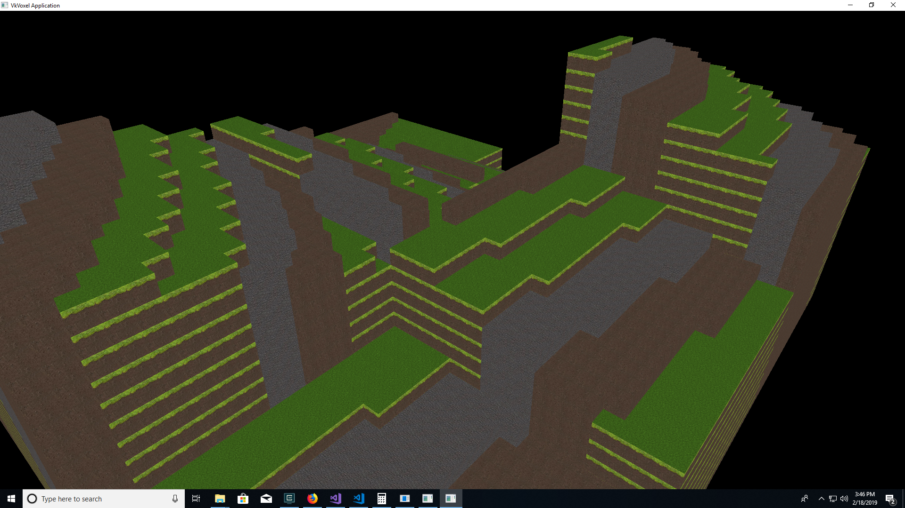

VkVoxel
====

This is an attempt at a voxel engine with a Vulkan renderer. It's primary purpose is for me to learn Vulkan and play with C++, which I don't get to do very often in my day job. The eventual plan is to have a multi threaded renderer that can handle chunk updates in another thread all the way from building the vertex buffer to uploading it to the GPU.

At the moment, it's heavily based on the awesome tutorial at https://vulkan-tutorial.com which I very much recommend. I'm slowly improving pieces of it, like using an allocator and eventually using multiple command pools, fencing buffer updates, etc...

To build, you need the Vulkan SDK, GLFW, GLM, and CMake. There is a CMake post build task to re-compile the shaders when they change, but it only works in Windows at the moment.

I'm releasing this under the MIT license. Do whatever the heck you want with it.

Here's a recent screenshot:

